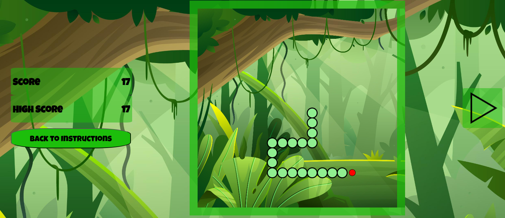
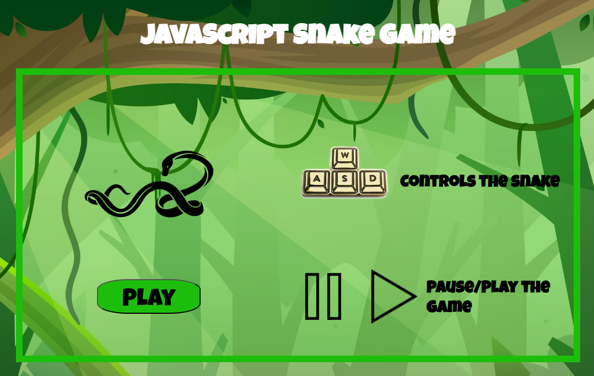

<!-- 

Table of Contents

 -->

# About the project

### Snake Game

This project was built as part of the **General Assembly's Software Engineering Immersive** course, the project is built without the use of any libraries or frameworks. 
The purpose of the project is to practice DOM manipulation with javascript.

### Built with
* HTML
* CSS
* JavaScript

---

# Game Flow
The snake would respawn on the grid and the goal is to navigate the area for food and not hit the wall or the body of the snake. 
The snake would start as a head only and would grow in length when food is eaten. 

---

# How to play
* W, A, S, & D keys are used to control the snake.
* Initially the snake will be still, till the player moves it.
* A pause/play buttons are available. After pausing the player will have to use WASD to move the snake again.
* score & high score are tracked.
* If the player loses at the game they will be prompted to restart.
* The player can navigate between the instructions page & the game page.

---

### Pseudocode
1- player respawn as a snake with one body segment.\
2- food respawns randomly.\
3- Snake will be still, untill the player uses the movemnet keys.\
4- player should move around with the intention to collect as much as possible without crashing into the walls or the snake's body.\
5- When the players reachs food, the body will increase in length \
6- The game continue to run till a wall is hit or the snake's body.
7- player may pause the game.

# sources
https://www.freecodecamp.org/news/javascript-2d-arrays/ \
https://css-tricks.com/snippets/css/complete-guide-grid/ \
https://www.youtube.com/watch?v=EiNiSFIPIQE&t=641s&ab_channel=SlayingTheDragon \
https://forum.freecodecamp.org/t/display-css-grid-lines/440618 \
https://developer.mozilla.org/en-US/docs/Web/API/Element/keydown_event \
https://www.toptal.com/developers/keycode \
https://developer.mozilla.org/en-US/docs/Web/API/setInterval \
https://travishorn.com/delaying-foreach-iterations-2ebd4b29ad30 \
https://stackoverflow.com/questions/11488014/asynchronous-process-inside-a-javascript-for-loop \
https://www.freecodecamp.org/news/recursion-in-javascript/ \
https://medium.com/codex/how-to-get-the-last-element-in-an-array-in-javascript-c106f2f4b830 \
https://developer.mozilla.org/en-US/docs/Web/JavaScript/Reference/Global_Objects/Array/unshift \
https://community.zapier.com/featured-articles-65/add-remove-items-in-an-array-with-push-pop-shift-unshift-14074 \
https://www.tutorialrepublic.com/faq/how-to-stop-setinterval-call-in-javascript.php \